# 这是什么？

这是一个steam的安装脚本，可以让你在没有浏览器，找不到Steam官网等条件下安装Steam，我相信如果你能访问到这里，你就一定能成功使用这个脚本安装。

# 在开始使用之前，讲一些小知识

## 什么是Steam？

[Steam](https://store.steampowered.com/ "点击这里访问官网")是Valve推出的电子游戏数字分发平台。2003年9月， Valve将其作为一款软件客户端推出，提供自动更新游戏的功能，这一功能在2005年末扩展到了第三方游戏发行商发行的作品。Steam集合了多种功能，如数字版权管理、游戏服务器匹配和反作弊系统，以及社交网络和游戏流媒体服务。

## 什么是脚本

在这里，名为steam安装脚本.ps1的文件就是一个脚本，至于脚本到底是什么，那就是另一个故事了。

## 什么是网页

你可以认为，每个和形如 `https://gitee.com/`的一串符号一一对应的画面都是一个网页。

# 脚本的使用条件

1. 软件上，确定您能访问这个界面。（什么是界面？额，就是电脑里形形色色可以相互遮挡画面，大多可以关闭和打开）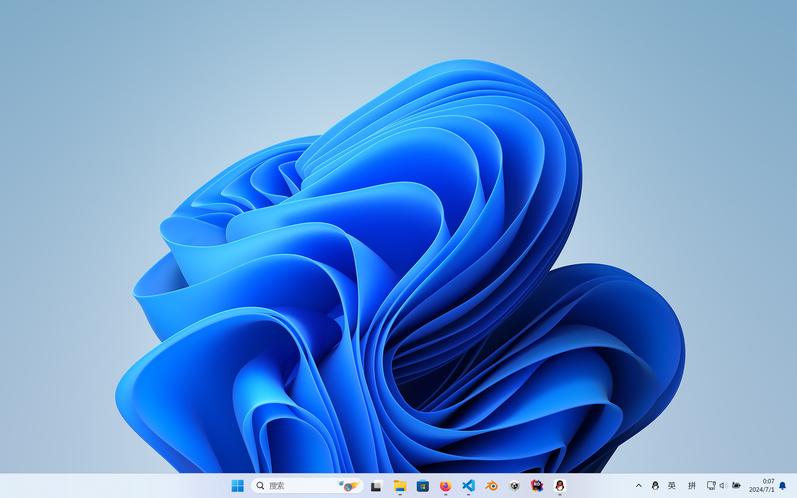

   这个界面应当有以下要素：

   比如，一个“田”字的符号（**不能是水果符号**）：

   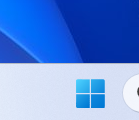

   和意味着“可以上网”的符号（有两种，任意出现一个就行了）：

   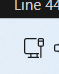或

   和键盘相关的符号：

   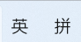
2. 硬件上，确保你有鼠标（且连在电脑上），并且知道什么是左键什么是右键。

   > 如果您没有鼠标或者不知道怎么连接鼠标，那么您可能只能使用方法一，那有一点难，但我相信你很厉害。
   >

   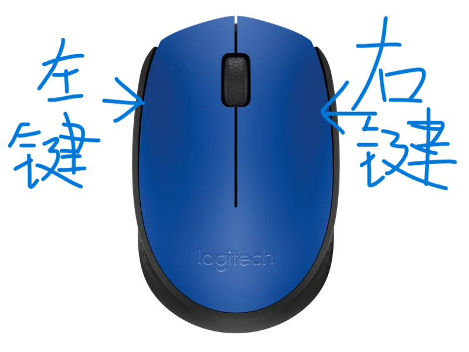

# 如何使用这个脚本？

有两种方法，效果相同，二选一即可。

## 方法一（比较难，但不需要真的访问这个网页，也不需要鼠标）

有可能您是通过截图知道这个网页的，这意味着您没法复制粘贴或者下载文件……

> 截图是什么？复制粘贴和下载是什么？文件是什么？一句话里四个词都看不懂怎么办？不要害怕。其实它们都不会被用到。不懂也没关系。

### 简单的说（后面第几步第几步的似乎有点啰嗦了，那么先简单说一下吧。）

```powershell
先同时按住“田”和“X”，再敲击“A”打开一个黑色窗口，如果出现一个窗口问你允不允许就选是。
输入下面这行英文咒语，然后按一下回车。等一会就安装好了（注意英语句号.）
winget install valve.steam
（如果你觉得等待时间过久，且确定你能打出下面的:/-等稀有字符可以在输入上一句之前输入下面两句）
winget source remove winget
winget source add winget https://mirrors.ustc.edu.cn/winget-source
注：
这个窗口就是一个大的输入栏，点击窗口然后按字母按钮就能把字母放进去了，注意空格，可以不注意大小写。
每写一行按一下回车键然后会产生文字，待其中文字停止产生，才能接着输入下一行。
搞错了就关掉窗口，从头再来就行了。
```

### 复杂的说

有可能您刚买电脑不久，对电脑不是太熟，那也没关系，我手把手教你。

#### 第零步 退出输入法

未完待续，但是如果您能让右下角变成了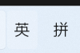这两个字，这一步就可以跳过。

#### 第一步 打开终端（一个黑色有字长方形）

由于一些历史原因，您的电脑应该都有许多按钮，这一步中我们一共要使用三个按钮，这三个按钮已经在图中标出：

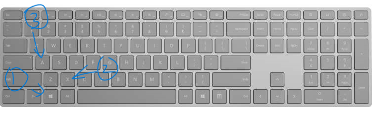

首先，按住“田”键（图中1号按钮，其图案有可能不是田字而是win三个字母）不要松开，再按住X键（图中2号按钮），然后松开两个按键（顺序任意）：

这时，画面中田字符号上方出现了一个表格（或者叫菜单，汉字后面的括号字母有可能没有，不影响）：

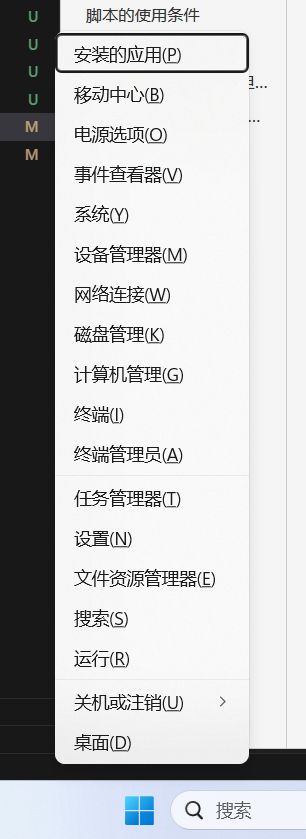

如果不小心进行了多余的操作，这个表格可能会消失，重复这一步就行了，电脑世界的好处就是，没有什么是不能重来的。

然后，敲击（按下后直接松开）A键（图中3号按钮）。这时会有个窗口问你允不允许，你就按一下窗口左下角的是字

这时我们需要的黑色有字长方形就出来了，他应该有powershell字眼，

> 具体有哪些字因人而异，您大概率没有我的绿色标记和“加载个人”开头的那句话，但那不影响

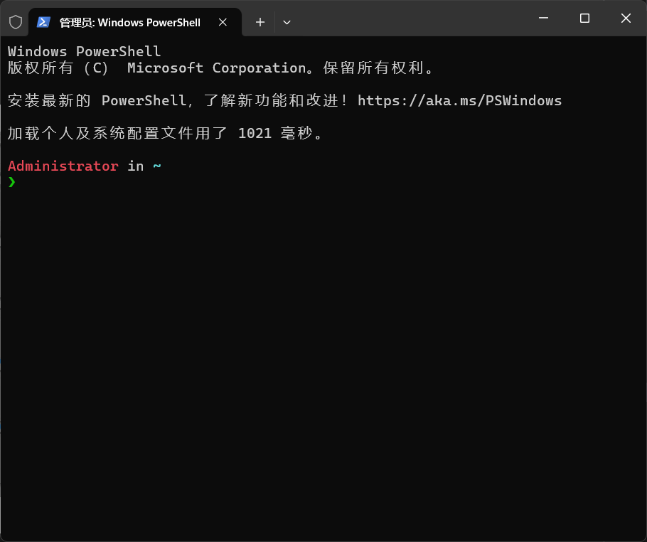

#### 第二步 输入“咒语”

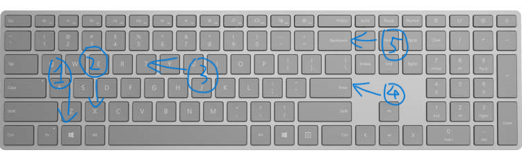

如果在出现黑色有字长方形后您没有进行任何操作，那么现在，按下英文字母按钮后对应字母就会出现在其中了。

> 如果没有出现的话，试着点击一下黑色有字长方形再按按钮

试着和平常打字一样，把下面这几句话放进去。

> 每写好一行咒语，需要按一下回车键（图中4号按钮）才能发动咒语，这时黑色有字长方形的文字会自己变化，等待其彻底停止变化后（这代表着咒语运行完毕）才能输入下一句咒语。


```powershell
#让下载steam加速的魔法，使用的前提是确定你能打出下面的:/-.等稀有字符，不然就跳过这两句，有耐心的等一等
winget source remove winget
winget source add winget https://mirrors.ustc.edu.cn/winget-source

# 下载steam的魔法
winget install valve.steam
```

以下是每句咒语完成后的示意图

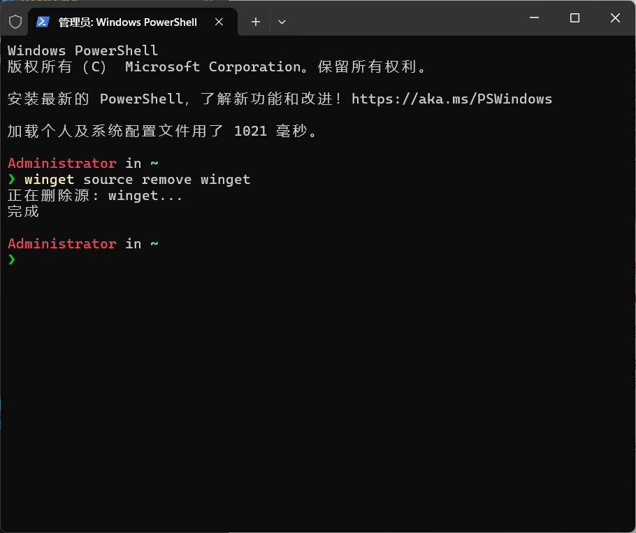

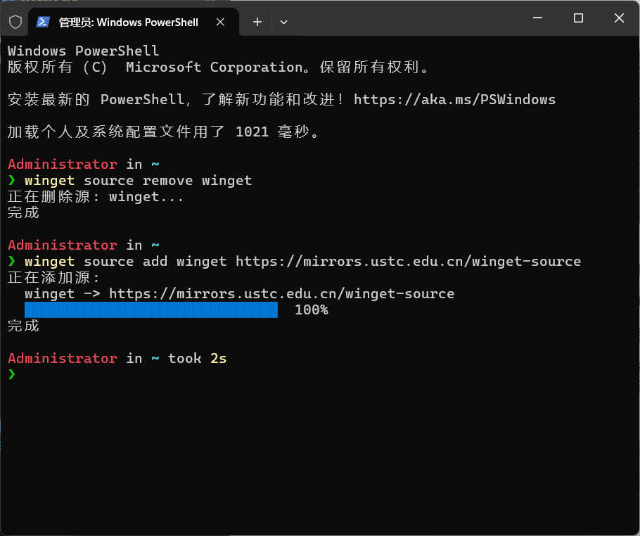
